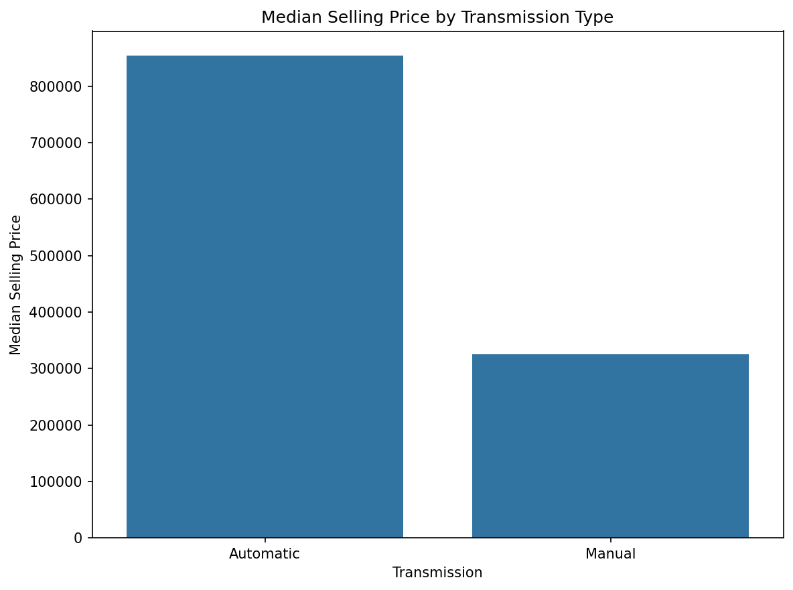
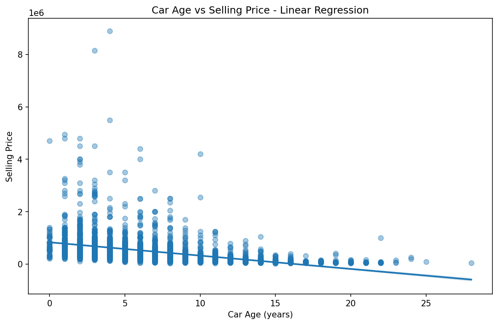
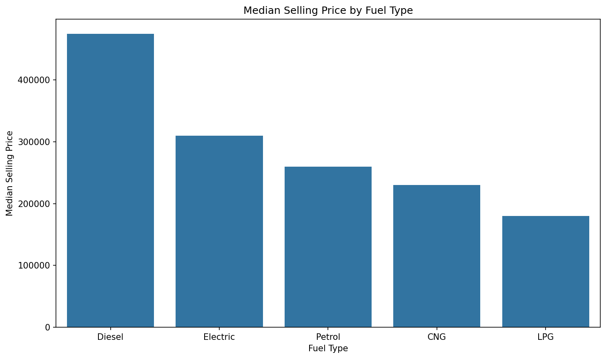
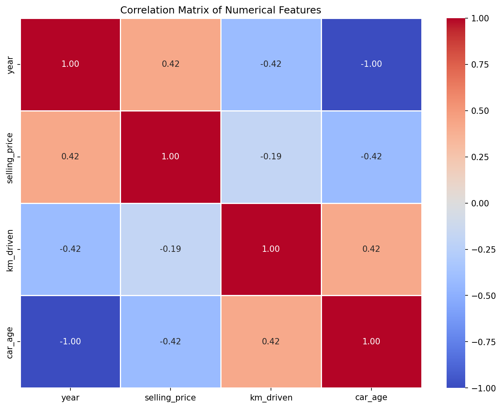

# Used Cars Price & Market Analysis

## Project Overview
Modular Python data pipeline and analysis suite exploring depreciation, transmission premiums, and seller behaviors in used car markets.

## Setup Instructions
```bash
# Install the package (with Jupyter and pytest) in editable mode.
# All dependency versions live in pyproject.toml.
python -m pip install -e ".[dev]"

# Run tests
python -m pytest
```

## Key Findings

Full statistical detail lives in `notebooks/03_statistical_analysis.ipynb` and `notebooks/04_executive_conclusions.ipynb`; the highlights below are pulled from that analysis of 3,577 cleaned listings.

### Transmission type carries a large price premium


- Automatic vehicles average **₹1,274,955**, versus **₹397,366** for manual — a premium of roughly **₹877,589**.
- The difference is statistically significant (Welch's t-test, p < 0.001), with a Cohen's d of **≈ 1.97** — a very large standardized effect.
- Caveat: automatics are a small slice of this dataset (312 of 3,577 cars, ~9%), so the group sizes are uneven. The effect is large enough that it's unlikely to be noise, but it's worth keeping the sample imbalance in mind.

### Selling price falls with car age


- A simple linear regression estimates each additional year of car age is associated with a **≈ ₹50,820** drop in selling price (p < 0.001).
- **R² ≈ 0.18** — car age alone explains about 18% of the variation in price. The relationship is real but far from the whole story; mileage, brand/model, fuel type, and transmission all contribute the rest.

### Fuel type also correlates with price


- Between the two well-represented fuel types, Diesel vehicles have a notably higher median price (**₹475,000**) than Petrol (**₹260,000**), on 1,800 and 1,717 cars respectively.
- CNG, LPG, and Electric together make up under 2% of the dataset (Electric is a single car) — interesting to note, but too few observations to draw reliable conclusions from.

### How the numeric features relate to each other


- Car age has a moderate negative correlation with price (r ≈ -0.42) — the strongest of the numeric predictors considered here.
- Kilometers driven correlates more weakly with price (r ≈ -0.19) than age does, once age is already accounted for.

All of the above describe **associations observed in this dataset**, not causal effects — see the notebooks for the full hypothesis tests, confidence caveats, and regression diagnostics behind each number.

## Analysis Workflow

Run the notebooks in order from the project root:

1. `notebooks/01_data_inspection.ipynb` loads and cleans the raw CSV.
2. `notebooks/02_exploratory_data_analysis.ipynb` explores distributions and relationships.
3. `notebooks/03_statistical_analysis.ipynb` runs hypothesis tests and regression.
4. `notebooks/04_executive_conclusions.ipynb` summarizes the main business findings.

The cleaned dataset is written to `data/cleaned_car_data.csv` by the first notebook. Charts produced by notebooks 2 and 3 are saved to `images/generated/` (not tracked in git; regenerated each run).